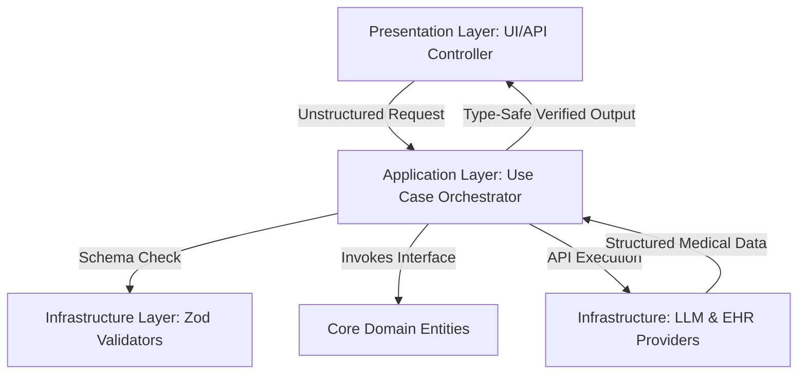

# Clinical AI Platform: Evolutionary Analysis & Scalability Blueprint

This document details the architectural lessons learned during the development of the Cityfront Healthcare AI Platform, followed by structural blueprints for refactoring the platform into a production-grade, highly scalable, and type-safe TypeScript application.

---

## 1. History & Chat Evolution: Pros & Cons

Based on the recent updates (removing mock John Doe fallbacks, migrating to multi-state preview pipelines, relaxing API key validation, and tuning chat assistant system prompts), here is a critical analysis of the current implementation:

### 🟢 Pros (Strengths of Current Design)
*   **Factual Live Output & Realism**: Eliminating hardcoded mock data constants (`MOCK_EXTRACTED_TEXT`, `MOCK_INSURANCE_FORM`) prevents clinicians from seeing synthetic "John Doe" data when uploading real patient records, ensuring absolute transparency.
*   **Robust Multi-State UI Rendering**: Step 3 (Preview) explicitly handles three distinct rendering pipelines: **Real Data Output** (with editing capability), **No Key Warning** (directing users to configuration), and **API Error Detail** (preventing silent crashes and printing raw error messages).
*   **Flexible Key Validation**: Shifting from prefix constraints (`sk-`, `AIza`) to a non-placeholder check with a length constraint (`>= 8`) allows the system to seamlessly support custom enterprise endpoints, API proxies (e.g. OpenRouter, Azure), and evolving key formats without UI-blocking validation errors.
*   **Optimized Conversational Flow**: Refactoring the Chat Assistant's system prompt from a defensive, rule-heavy model to a structured clinical persona stopped the model from treating basic greetings (like "hi") as "incoherent queries," leading to fast, natural, and helpful clinical co-pilot responses.

### 🔴 Cons (Limitations & Refactoring Needs)
*   **Coupled Framework UI and Business Logic**: Much of the multi-agent rendering, API calling, and exception capturing is handled directly within Streamlit page files (`2_📋_Prior_Authorization.py`). As the app grows, this makes testing and maintainability difficult.
*   **Synchronous Delay Loops**: The simulated "agent working" progress animation in Step 2 uses synchronous `time.sleep()` blocks. This blocks the main thread, delaying actual network requests until the animation completes.
*   **Weak State Schemas**: Clinical details are stored and passed around as raw Markdown strings or unstructured dictionary maps. This poses severe risks of structural degradation if the LLM output deviates from the expected format.

---

## 2. Key Considerations for Creating Medical AI Projects

When building or scaling high-stakes medical decision support systems, the following architectural paradigms are mandatory:

1.  **Strict Schema Enforcement (No Markdown-only Pipelines)**:
    Never rely on unstructured Markdown directly in downstream systems. LLM responses must be parsed through structured schemas (e.g., JSON schemas or Pydantic models) to guarantee that crucial medical fields (Patient Name, DOB, CPT Code, NPI) are always present, non-empty, and correctly formatted.
2.  **Explicit Consent & Verification Loop**:
    Automated prior authorization systems must never submit documents directly. The UI must provide a **"Clinician-in-the-Loop" Verification Panel** (such as our Step 3 Preview) allowing manual edits to the extracted fields before approval.
3.  **Auditable Logging & Prompt Tracing**:
    Every LLM input, output, image, and raw system instruction must be traceable. Integrating logging tools (like LangSmith or Arize Phoenix) is necessary to diagnose why a medical necessity logic match succeeded or failed.
4.  **Air-Gapped / HIPAA-Compliant Model Endpoints**:
    Enterprise medical applications must direct LLM calls to secure VPC instances (e.g., Azure OpenAI, AWS Bedrock, or private Google Cloud Vertex AI instances) with data-zero-retention policies rather than standard public APIs.

---

## 3. TypeScript Refactoring for Clinical Safety & Productivity

Migrating the application to **TypeScript** (e.g., using a React/Next.js frontend and a Node.js/NestJS backend) dramatically improves engineering productivity, performance, and runtime safety.

### Why TypeScript is Crucial for Clinical AI
*   **Compile-time Medical Schemas**: Enforces compile-time checks so that any code referencing `PatientRecord` or `MCGRequirement` contains the exact fields required by medical compliance.
*   **Zod Runtime Validation**: Guarantees that unstructured LLM outputs parsed into JSON match the expected clinical types at the API boundary, throwing immediate, readable errors before bad data reaches database or EHR systems.

### TypeScript Optimization Setup
Ensure your `tsconfig.json` enforces strict validation rules:
```json
{
  "compilerOptions": {
    "target": "ES2022",
    "module": "NodeNext",
    "moduleResolution": "NodeNext",
    "strict": true,
    "noImplicitAny": true,
    "strictNullChecks": true,
    "exactOptionalPropertyTypes": true,
    "noImplicitReturns": true,
    "noUnusedLocals": true,
    "resolveJsonModule": true
  }
}
```

### Type-Safe Extraction Example (Zod + LangChain TS)
```typescript
import { z } from "zod";

// 1. Define strict clinical schema
export const PatientDetailsSchema = z.object({
  fullName: z.string().min(2),
  dateOfBirth: z.string().regex(/^\d{2}-\d{2}-\d{4}$/), // DD-MM-YYYY
  memberId: z.string().min(4),
  payerName: z.string().min(2),
  requestedService: z.string(),
  cptCode: z.string().length(5),
  icd10Codes: z.array(z.string())
});

export type PatientDetails = z.infer<typeof PatientDetailsSchema>;
```

---

## 4. Scalable & Extensible Architecture Folder Layout

As this platform scales to support more EHR systems, insurance payers, and clinical guidelines, a **Modular, Decoupled Architecture** is essential. Below is the blueprint folder structure designed for scalability and clean separation of concerns:

```
clinical-ai-platform/
├── docs/                           # Architecture and guideline definitions
├── config/                         # Environment variables and model configuration
│   └── tsconfig.json
├── src/
│   ├── core/                       # Clean domain logic, completely framework-agnostic
│   │   ├── entities/               # Standard medical data structures
│   │   │   ├── patient.entity.ts
│   │   │   └── prior-auth.entity.ts
│   │   └── interfaces/             # Port definitions for downstream services
│   │       ├── llm-service.interface.ts
│   │       └── ehr-adapter.interface.ts
│   │
│   ├── infrastructure/             # Adapters for external APIs, libraries, and frameworks
│   │   ├── llm/                    # LangChain/LLM provider integrations
│   │   │   ├── providers/
│   │   │   │   ├── gemini.provider.ts
│   │   │   │   └── openai.provider.ts
│   │   │   └── langchain-executor.ts
│   │   ├── ehr/                    # Electronic Health Record adapters (Epic, Cerner)
│   │   │   ├── fhir-client.ts
│   │   │   └── mock-ehr.adapter.ts
│   │   └── schemas/                # Runtime Zod validation schemas
│   │       ├── patient.schema.ts
│   │       └── prior-auth.schema.ts
│   │
│   ├── application/                # Orchestrates domain logic and use cases
│   │   ├── use-cases/
│   │   │   ├── extract-clinical-note.ts
│   │   │   ├── validate-necessity.ts
│   │   │   └── generate-pa-pdf.ts
│   │   └── services/
│   │       └── orchestrator.service.ts
│   │
│   └── presentation/               # Delivery channels (APIs, Web interfaces, Webhooks)
│       ├── web/                    # React / Next.js / Streamlit-like UI components
│       │   ├── components/
│       │   │   ├── DocumentViewer.tsx
│       │   │   ├── PreviewForm.tsx
│       │   │   └── ChatWindow.tsx
│       │   └── pages/
│       └── api/                    # REST / GraphQL controller endpoints
│           ├── controllers/
│           │   ├── auth-request.controller.ts
│           │   └── chat.controller.ts
│           └── middleware/
│
├── tests/                          # Standardized test workspace
│   ├── unit/                       # Component and domain logic tests
│   └── integration/                # End-to-end multi-agent pipeline tests
└── package.json
```

### Architectural Flow of Data


By decoupling domains in this format, you can safely swap out UI frameworks (e.g., transitioning from Streamlit to React), change your database, or migrate between AI model providers without changing your core medical necessity logic.

---

## 5. Migrating Streamlit UI to React & TypeScript

Transitioning the presentation layer from a Python-based Streamlit environment to a modern TypeScript React application (such as Next.js or Vite) changes how state, rendering, and performance are handled:

### 🔄 Architecture Shift: Streamlit vs. React + TypeScript

| Paradigm / Feature | Streamlit (Python) | React + TypeScript (TSX) |
|---|---|---|
| **Execution Model** | Full-script re-run on every user action / input change | Component-level reactive rendering via Virtual DOM |
| **State Management** | Flat session state (`st.session_state`) | Structured component state (`useState`) or global stores (`Zustand`, `Redux`) |
| **Pipeline Workflow** | Hardcoded conditional page flow (`st.session_state.pa_step`) | Declarative state machine (`type Step = 'LOAD' \| 'RUNNING' \| 'PREVIEW'`) |
| **Styling & Layout** | Raw CSS injection inside `unsafe_allow_html` markdown | Declarative Tailwind CSS, CSS Modules, or UI Components |
| **Component Safety** | Runtime string checking (prone to typo failures) | Compile-time component interface enforcement (`Props` contracts) |

### 🛠️ Streamlit to React Component Mapping Blueprint

Here is how to map the current Streamlit clinical components directly to React + TSX structures:

1.  **File Upload & Preview (Step 1)**:
    *   *Streamlit*: `st.file_uploader` displaying `st.image` on the right column.
    *   *React + TS*: A file drop-zone component using `react-dropzone` that handles image uploads, generates an object URL (`URL.createObjectURL(file)`), and renders inside a standard `` tag with full loading states.
2.  **Agent Working Overlay (Step 2)**:
    *   *Streamlit*: Dynamic injection of glassmorphism overlays and CSS keyframe animations, backed by blocking `time.sleep()` loops.
    *   *React + TS*: An asynchronous agent workflow that triggers real backend API requests concurrently. The frontend renders a sleek glassmorphism overlay using CSS backdrop filters, tracking the processing status dynamically in state (e.g. `const [steps, setSteps] = useState<AgentStep[]>([])`) without blocking the main browser thread.
3.  **Prior Auth Preview Form (Step 3)**:
    *   *Streamlit*: Split layout columns showing an image on the left and a scrollable card rendering markdown output on the right.
    *   *React + TS*: A split-view layout. The right side uses a rich-text or markdown editor component (e.g. `react-markdown`) styled inside a card container, allowing the clinician to dynamically edit the generated text fields in real time.
4.  **Floating Co-Pilot Chat Assistant**:
    *   *Streamlit*: Popover widget (`st.popover`) wrapping suggestions, message blocks, and input text fields.
    *   *React + TS*: A custom floating action button (FAB) that toggles a fixed-position floating panel. The panel communicates with a real-time WebSocket or Server-Sent Events (SSE) server for instant, character-by-character streaming responses.

### 💡 TypeScript UI Productivity Benefits
*   **Form Schema Validation**: Integrating **Formik** or **React Hook Form** with **Zod** schema resolvers guarantees that clinicians cannot accidentally submit a prior authorization form with missing required fields (e.g., empty physician NPI or invalid CPT code format).
*   **Strict Props Contracting**: Every sub-component (e.g., `<StatusCard type="error" />`) has its props strictly typed at compile time. This prevents runtime visual bugs like displaying incorrect colors, missing icons, or broken action buttons.
*   **Component Reusability**: Complex elements like medical necessity tables, checklist badges, and custom scrollbars can be packaged into standard, reusable TSX components under `src/presentation/web/components/`.

---

## 6. Database Architecture & Comparison

A clinical AI platform requires handling three distinct types of data workloads:
1.  **Clinical/System Metadata (Relational & Structured)**: Demographics, prior authorization forms, audit trails, user access logs, and workflow steps. Must be strictly ACID compliant for medical auditing and HIPAA compliance.
2.  **Unstructured OCR & FHIR Payloads (Document & Semi-structured)**: Raw OCR outputs, variable patient notes, and nested JSON payloads received from hospital EHR integrations (Epic, Cerner).
3.  **Medical Guidelines & Embeddings (Vector search)**: MCG / InterQual clinical guidelines, historical approvals, and vector embeddings for semantic search in Retrieval-Augmented Generation (RAG).

### 📊 Database Options Comparison Matrix

| Database Option | Best Suited For | Pros | Cons | Recommendation |
|---|---|---|---|---|
| **PostgreSQL** *(with `pgvector`)* | Relational medical data, audit logs, and unified vector storage. | • Strong ACID compliance, transactional guarantees, and row-level security (RLS).<br>• `pgvector` allows storing and querying vector embeddings directly alongside metadata.<br>• Unifies relational and vector data in a single robust database. | • Scaling horizontally is more complex compared to NoSQL systems.<br>• Document indexing requires upfront setup (using JSONB fields). | **🏆 Highly Recommended (Primary)**: The single best database choice for HIPAA-regulated clinical AI systems due to security, transactions, and unified vectors. |
| **MongoDB** *(NoSQL / Document)* | High-volume, heterogeneous JSON clinical records (FHIR payloads, OCR caches). | • Schema-less document storage matches EHR JSON outputs perfectly.<br>• Extremely simple and fast horizontal scaling (sharding).<br>• Flexible schemas accommodate changing healthcare standards. | • Joins and relational integrity are complex and expensive.<br>• Relational audits require manual application-level constraints.<br>• Lacks mature built-in native relational vector indexes. | **Good Secondary (Cache Layer)**: Excellent for caching raw OCR extractions and FHIR messages, but should not be the single source of truth for auditable transaction records. |
| **Dedicated Vector DB** *(Pinecone, Milvus)* | High-frequency, massive-scale semantic searches (millions of medical guidelines). | • Unmatched query performance and throughput at extreme vector scales.<br>• Built-in index optimizations specifically for vector math. | • Cannot store relational records, user credentials, or system logs.<br>• Requires maintaining and synchronizing two separate databases, increasing architecture latency and synchronization bugs. | **Optional (Scale-Only)**: Only recommended if the platform scales to handle millions of document guidelines. Otherwise, PostgreSQL's `pgvector` is much simpler to maintain. |

### 🔒 HIPAA Compliance & Database Best Practices
When deploying any database for clinical operations, you must ensure:
*   **Encryption at Rest & Transit**: Use AES-256 for storage and TLS 1.3 for active connections.
*   **Detailed Audit Logging**: Write write-once-read-many (WORM) audit logs tracking who accessed which patient records, when, and what was changed.
*   **Row-Level Security (RLS)**: Restrict data access so that clinicians can only query patient records belonging to their clinic or department.

---

## 7. Lookup Optimization & Operational Productivity Blueprint

In a real-world hospital deployment (e.g., handling ~100 prior authorization requests per day), each request initiates dozens of downstream lookups: cross-referencing patient history in EHRs, matching diagnostic ICD-10 and CPT codes, and parsing complex medical necessity policy guidelines (MCG/InterQual).

To prevent performance bottlenecks and maximize engineering productivity, the following architectural optimization strategies must be applied:

### 1. Concurrent Lookup Orchestration (Async Execution)
Instead of sequentially looking up clinical guidelines, checking patient records, and verifying insurance plans, execute all independent lookups concurrently. This reduces the total response time to the speed of the single slowest external call.

*   **Implementation Pattern (TypeScript)**:
```typescript
// Fetch patient records, guidelines, and billing codes in parallel
const [patientHistory, clinicalGuidelines, insurerPolicies] = await Promise.all([
  ehrAdapter.fetchPatientHistory(patientId),
  guidelineRegistry.fetchByCptCode(cptCode),
  payerAdapter.fetchPolicyRules(payerId, cptCode)
]);
```

### 2. Multi-Tier Intelligent Caching
*   **Static Reference Cache**: Medical codes (ICD-10, CPT, HCPCS) and clinical rulebooks change infrequently (quarterly or annually). Cache these definitions in-memory inside **Redis** or a local in-process cache (e.g., **Node-Cache** / **Memory Cache**) with long TTLs. This bypasses slow database or external API queries entirely.
*   **Active Session Cache**: Temporary storage of active OCR extractions and draft prior authorization forms during a clinician's editing session to prevent unnecessary repeated LLM calls when a user reloads the page.

### 3. Hierarchical Hybrid Search (BM25 + Semantic pgvector)
Avoid running expensive vector searches across your entire guideline database on every query. Use a fast, progressive two-stage retrieval structure:
1.  **Stage 1 - Strict Keyword Filtering (BM25)**: Instantly filter guidelines down to a small, relevant subset using exact terms like the CPT code (`72148`) or ICD-10 code (`M54.16`).
2.  **Stage 2 - Local Semantic Search (`pgvector`)**: Only perform vector cosine similarity calculations against that highly filtered subset to match semantic patient indicators (e.g., "lower back pain radiating down thigh").

*   **Optimized SQL Query Example**:
```sql
-- Fast, indexed metadata match followed by local vector search
SELECT id, document_text, cosine_distance
FROM clinical_guidelines
WHERE cpt_code = '72148' -- Indexed metadata filter
ORDER BY embedding <=> :patient_note_vector -- Fast local vector distance calculation
LIMIT 3;
```

### 4. Semantic Prompt Caching (LLM Cost & Latency Reduction)
Hospitals frequently process highly similar clinical notes (e.g., lower back pain, knee joint osteoarthritis).
*   **Vector Semantic Caching**: Before making a costly LLM API call to analyze a clinical note, query your vector database for historically processed notes with a similarity score of `>= 0.98`.
*   **Direct Result Re-use**: If a match is found, immediately serve the previously approved structured extraction and clinical form, reducing processing latency from ~10 seconds to sub-millisecond speeds.

### 5. Specialized Micro-Agent Workflows
Maximize engineering productivity by breaking a monolithic LLM pipeline into **specialized single-responsibility tools** rather than a single massive agent.
*   **Benefits**:
    *   **Developer Focus**: Engineers can edit, test, and debug individual agents (e.g., CPT Code Matching Tool, ICD-10 Parsing Tool) in isolation without breaking the main prior authorization pipeline.
    *   **Targeted Optimization**: Run cheaper, faster models (e.g., `gpt-4o-mini` or `gemini-1.5-flash`) for structural parsing and save the larger, slower models for complex final medical necessity reasoning.
